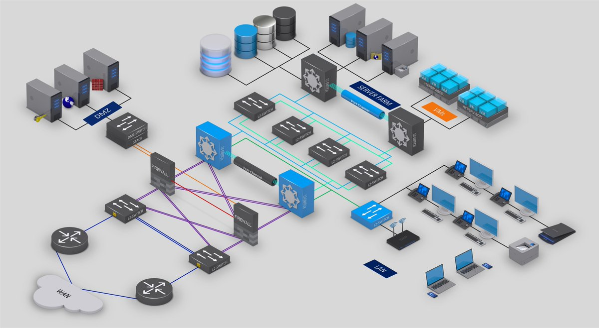

# การออกแบบงานระบบ (Network) เบื้องต้น

การออกแบบระบบเครือข่ายเป็นปัจจัยหลักที่จะแสดงว่าระบบเครือข่ายของเรานั้นมีความเสถียรภาพ และปลอดภัยมากแค่ไหน ซึ่งหลักการออกแบบระบบเครือข่ายเบื้องต้นให้กับองค์กรหรือหน่วยต่างๆ นั้นควรจะต้องคำนึงถึงหลักการ 7 ข้อเหล่านี้ ซึ่งได้แก่
- Speed
- Cost
- Security
- Availability
- Scalability
- Reliability
- Topology

## 1. Speed (ความเร็ว)
โดยความเร็วที่ใช้นั้นต้องเป็นความเร็วที่เหมาะสมกับในยุคปัจจุบัน เช่น ในระบบเครือข่ายแบบใช้สาย (Wire Network) ต้องมีความเร็วระดับ 1 Gbps ขึ้นไป และถ้าเป็นในระบบเครือข่ายแบบไร้สาย (Wireless Network) ก็ต้องเป็นแบบมาตรฐาน IEEE 802.11n ( b/g/n ) ที่ความเร็วมากกว่า 54 Mbps ขึ้นไป ส่วน Link Internet ที่ใช้ ต้องเลือก Speed หรือ Bandwidth ที่เหมาะสม และเพียงพอกับองค์กรของเรา โดยต้องแยกเป็น Link Local (Internet ภายในประเทศ) และ Link Inter (Internet ภายนอกประเทศ) ให้เหมาะสม และควรจะมีอย่างน้อย 2 Link เพื่อให้ระบบเครือข่ายสามารถใช้งานได้ต่อเนื่องกรณี Link ใด Link หนึ่ง Down 

## 2. Cost (ค่าใช้จ่าย)
ซึ่งค่าใช้จ่ายนั้นคงเลือกไม่ได้ที่จะให้ราคาถูก เนื่องจากอุปกรณ์ทางด้านไอทีส่วนใหญ่แล้วจะมีราคาแพง แต่สิ่งที่ควรดูเพื่อช่วยตัดสินใจนั้นก็คือ ความคุ้มค่า เช่น ในเรื่องของการรับประกัน การบริการหลังการขาย และความคงทนของอุปกรณ์ เป็นต้น ตัวอย่างเช่น อุปกรณ์ A และ B ราคาเท่ากัน หรือต่างกันไม่มาก อุปกรณ์ A รับประกัน 1 ปี แต่อุปกรณ์ B รับประกัน Lifetime, อุปกรณ์ A ถ้าเสียต้องส่งซ่อมเอง อุปกรณ์ B มีบริการรับเคลมถึงสถานที่, อุปกรณ์ A มีประวัติมีปัญหาบ่อย อุปกรณ์ B มีชื่อเสียงในเรื่องความคงทน และความเสถียร เป็นต้น ดังนั้นควรที่จะพิจารณาในเรื่องของความคุ้มค่า และคุ้มทุนที่สุดในระยะยาว

## 3. Security (ความปลอดภัย)
ระบบเครือข่ายที่ดีควรมีความปลอดภัยสูง มีการจำกัดการใช้งานทั้งภายใน และภายนอกองค์กร ไม่ใช่ว่าใครก็สามารถเข้าสู่ Network เราได้ง่ายๆ ซึ่งควรจะต้องมี Firewall เป็นด่านหน้าของระบบ ซึ่งอาจจะเป็นรูปแบบของ Hardware หรือ Software ก็ได้ แต่ถ้าไม่มี Firewall จริงๆ ก็ควรจะมีอย่างน้อย 2 สิ่งนี้ทดแทนคือ การ Authentication และ Encryption โดยการ Authentication คือ การพิสูจน์ตัวตนด้วยวิธีการใดวิธีการหนึ่ง เพื่อให้บุคคลหรืออุปกรณ์ที่ได้รับอนุญาตเท่านั้น จึงจะสามารถใช้งาน Network ของเราได้ เช่น การใส่รหัสตัวเลข หรือการใส่ Username และ Password ก่อนเข้าใช้ Network ได้ รวมถึงการระบุ IP Address หรือ Mac Address ที่อนุญาตให้ใช้งาน Network ได้ ส่วนการ Encryption นั้น คือการเข้ารหัสการติดต่อสื่อสารระหว่างเครื่องคอมพิวเตอร์ด้วยกัน หรือระหว่าง Host กับ Host หรือ Host กับ Server ( Host คืออุปกรณ์ที่สามารถ Set IP Address ได้ เช่น Computer, Smartphone, IP Phone, IP Camera, Access Point, Router และอื่น ๆ อีกมากมาย ) ซึ่งทั้งการ Authentication และ Encryption มีอยู่หลายวิธี ขึ้นอยู่กับอุปกรณ์ และเทคโนโลยีที่ใช้ และที่สำคัญควรมีการเก็บประวัติหรือ Log การใช้งานด้วย และควรเก็บไว้ได้อย่างน้อย 90 วัน เนื่องจากในปัจจุบันจะมี พรบ.คอมพิวเตอร์ บังคับไว้อยู่ด้วยนั่นเอง

## 4. Availability (การที่สามารถใช้งาน Network ได้ดี) 
ซึ่งการที่จะสามารถใช้งานระบบเครือข่ายได้ดีนั้นควรจะเป็นแบบ High Availability คือต้องไม่มีการ Down ของระบบเลย โดยต้องสามารถใช้งานได้ตลอดเวลา และใช้งานได้เต็ม Speed หรือ Bandwidth นั่นเอง โดยไม่มีการช้า, ใช้งานได้บ้างไม่ได้บ้าง หรือใช้งานไม่ได้เลย ซึ่งควรจะมีระบบ Redundant หรือ Load Balance ในระบบ

## 5. Scalability (การสามารถขยาย, เติบโตได้) 
โดยระบบเครือข่ายที่ดีต้องสามารถขยายได้ เติบโตได้ โดยที่ไม่ต้องลงทุนเพิ่ม หรือถ้ามีก็ต้องมีค่าใช้จ่ายน้อยที่สุด ยกตัวอย่างเช่น การจัดซื้ออุปกรณ์ ในรุ่นที่เป็นแบบ Classic คือไม่สามารถใส่ Card หรือ RAM เพิ่มเข้าไปได้ กับรุ่นที่สามารถใส่เพิ่มเข้าไปได้ ก็ต้องเลือกรุ่นที่สามารถใส่เพิ่มเติมได้ในภายหลัง, การออกแบบระบบเครือข่ายภายใน (LAN) ปัจจุบัน ควรออกแบบเป็นแบบ Wireless LAN แทนระบบสาย LAN แบบเดิม แต่ถ้าจำเป็นต้องเดินสาย LAN แบบเดิมจริงๆ เช่นการเชื่อมต่อระหว่าง Server กับ Router ก็ต้องมีการเดินสาย LAN เผื่อไว้ด้วย, การเลือกติดตั้ง OS หรือ Software สำหรับ Server บาง Service ควรใช้ Linux Server หรือ Software Opensource เพราะจะประหยัดค่าใช้จ่ายเรื่อง License ในกรณีที่มี User หรือผู้ใช้งานเพิ่มขึ้นในอนาคต

## 6. Reliability (ความน่าเชื่อถือ, ความเชื่อมั่น) 
โดยระบบเครือข่ายที่ดีต้องมีความน่าเชื่อถือสูง 100% ไม่ Down คือต้องใช้งานได้ตลอดเวลาไม่มีการ Down ยกตัวอย่างเช่น ระบบเครือข่ายของธนาคาร, ตลาดหุ้น หรือของผู้ให้บริการโทรศัพท์มือถือ เป็นต้น ควรจะมี Link ขั้นต่ำ 2 Link อุปกรณ์ทุกตัวใน Network ต้องมี 2 ตัวทั้งหมด มีระบบสำรองไฟฟ้าที่ดี ต้องทำให้ User หรือผู้ใช้งานเชื่อมั่น เชื่อถือว่าใช้งานได้จริง ไม่โดนขโมยข้อมูลส่วนตัว เป็นต้น ควรมีระบบ Redundant หรือ Load Balance และควรมี DR Site ด้วย

## 7. Topology (ลักษณะของการเชื่อมโยงสายระหว่างอุปกรณ์ต่างๆ) 
การเชื่อมต่อในระบบเครือข่ายภายใน (LAN) เช่น เชื่อมต่อแบบ BUS, STAR, RING หรือแบบผสม เป็นต้น ในปัจจุบันควรออกแบบให้เหมาะสม โดยอ้างอิงกับหลักการออกแบบระบบเครือข่ายที่ถูกต้องคือ ควรออกแบบเป็นลำดับชั้น (Hierarchical Network Design) คือมี 3 ส่วน ดังนี้ Core Layer, Distribution Layer และ Access Layer และแต่ละส่วนควรมีอุปกรณ์ขั้นต่ำ 2 ตัว และการ Design IP Address ควร Design ตามหลักการของ VLSM (การออกแบบ Subnet Mask ที่มี Length ของ Prefix ที่สามารถเปลี่ยนแปลงได้) เพื่อให้ใช้ IP ได้อย่างคุ้มค่าที่สุด
